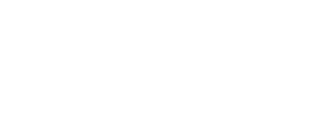
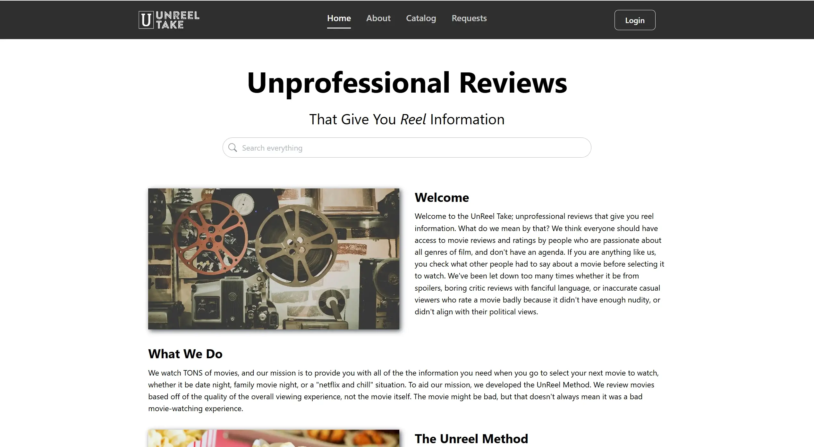

---

## About

The Unreel Take is a curated library of reviews for a wide variety of media such as: movies, TV shows, video games and more! 
Run by a small team of passionate hobbyists, The Unreel Take team judges entertainment based not just on quality alone, but the overall experience you're likely to have.
The team are committed to delivering high-value, no-AI, no nonsense and free-to-read articles so that you can find the *experience* that you're looking for.

---

## Project Overview

**The Problem:** The Product Owner needs a blog-posting and content management system website that allows for the creation and management of articles.

**Our Solution:**

- **Frontend:** Our frontend solution implements a public home route complete with a searchable catalog, an about page, and media request form.
- **Backend:** Our backend solution implements a private, invitation-only, user dashboard with a suite of content management tools.

---

## Tech Stack

| Type           | Technologies                  |
|----------------|-------------------------------|
| Frontend       | Next.js, React.js, Mantine UI |
| Backend        | Node.js, TypeScript           |
| Database       | Prisma ORM, Neon PostgreSQL   |
| Deployment     | Vercel                        |
| Documentation  | TSDoc                         |
| Testing        | Vitest                        |
| Authentication | Better Auth                   |
| Analytics      | Google Analytics              |
| Email          | Resend                        |

---

## Work Summary

For each sprint, we focused our efforts on delivering fully functional features. 
We wanted the website to be usable at every stage of development which allowed us to gain client feedback on overall direction.

### Sprint 1 - Project Charter & Website Mockup

Setting up of the project charter document and creation of the initial website mockup.
The client gave us much freedom over the website design, so the mockup was necessary for feature visualization.

### Sprint 2 - User Invitation & Account Setup

We started with the first high-priority feature request: user invitation and new user account setup. 
These features allow any site administrators to control user access and accounts to invitees only. 

### Sprint 3 - Rich Text Editor & Post Management

This sprint marked the implementation of the second high-priority feature: a rich text editor and post management views.
These features allowed users to begin modifying and creating new content to the site.

### Sprint 4 - Content Tagging, Request Management & Post Drafts

This marks the point we started work on new database schemas to implement content tagging, media requests and post drafting.
The features implemented here allowed users to begin categorizing their content and respond to audience feedback.

### Sprint 5

### Sprint 6

### Sprint 7

### Sprint 8

### Sprint 9

---

## Developer Instructions

To be completed during CSC 191

---

## Testing

To be completed during CSC 191

---

## Team

**Product Owner:** Brandon Eiland

| Team Coffee Coders    |
|-----------------------|
| Aidan Anderson        |
| Brian Segura Chagolla |
| Elias Rangel          |
| Izak Puente Zavala    |
| Jalen Sun             |
| Logan Jenkins         |
| Melvin Ly             |
| Preston Stevenson     |
